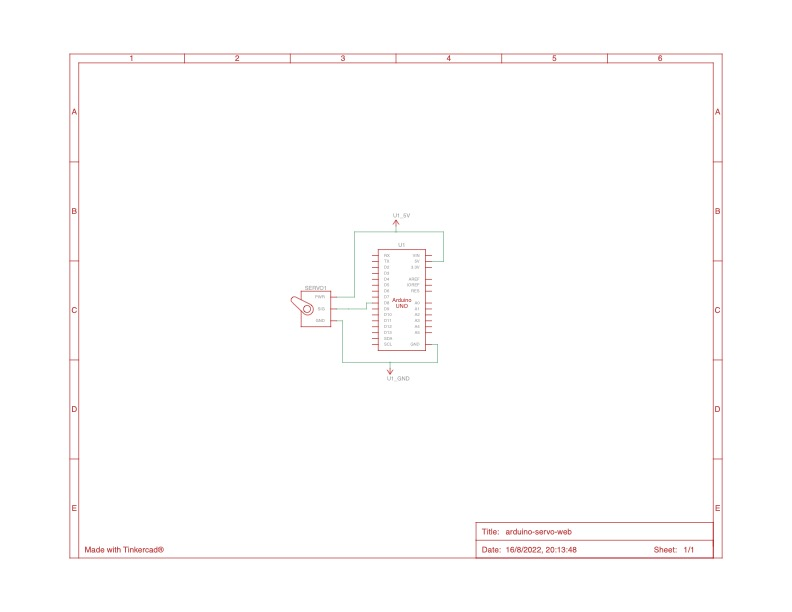
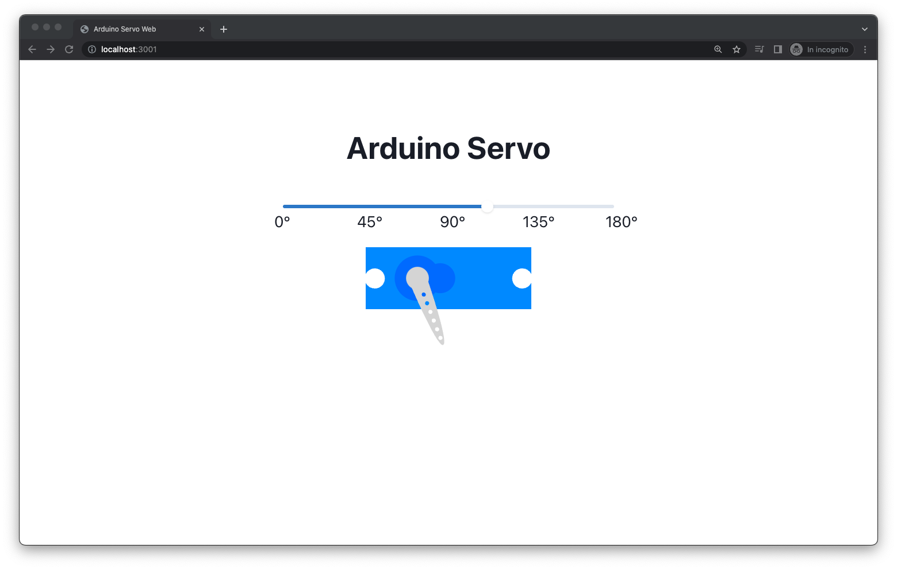

# arduino-servo-web

Control a servo motor through a web app

## Schema



## Setting

1. Connect the Arduino to the PC
2. Install dependencies in `backend` and `frontend` with:
  ```sh
  yarn
  ```
3. Start backend server
  ```sh
  cd backend
  yarn start
  ```
4. Start React App
  ```sh
  cd frontend
  yarn dev
  ```

## Usage

* From React App
* From Command Line
  * Get degrees
    ```sh
    curl "http://localhost:3000/"
    ```
  * Set degrees
    ```sh
    curl -x POST "http://localhost:3000/[degToSet]"
    ```

## Screenshots


